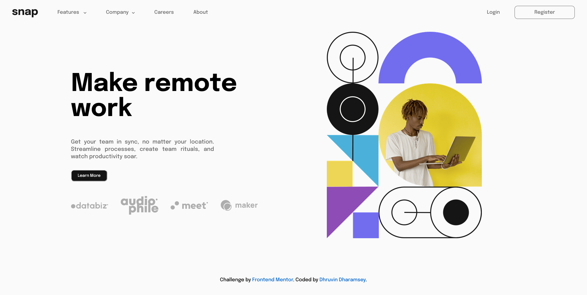
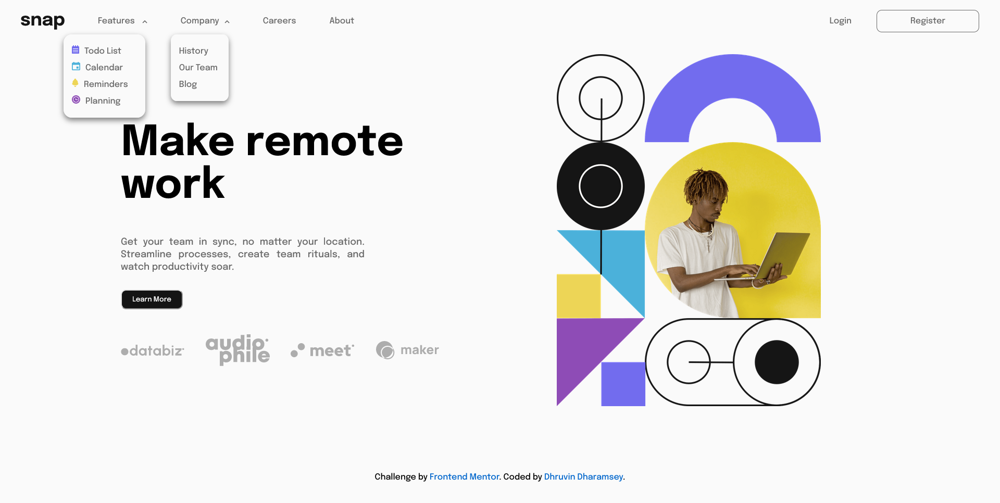
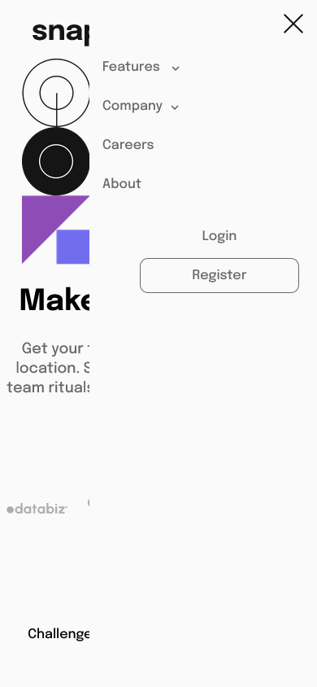
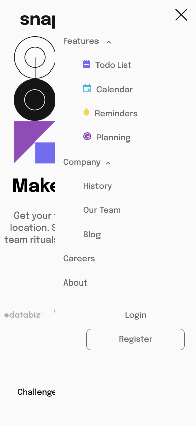

# Frontend Mentor - Intro section with dropdown navigation solution

This is a solution to the [Intro section with dropdown navigation challenge on Frontend Mentor](https://www.frontendmentor.io/challenges/intro-section-with-dropdown-navigation-ryaPetHE5). Frontend Mentor challenges help you improve your coding skills by building realistic projects. 

## Table of contents

- [Overview](#overview)
  - [The challenge](#the-challenge)
  - [Screenshot](#screenshot)
  - [Links](#links)
- [My process](#my-process)
  - [Built with](#built-with)
  - [What I learned](#what-i-learned)
  - [Continued development](#continued-development)
- [Author](#author)

## Overview

### The challenge

Users should be able to:

- View the relevant dropdown menus on desktop and mobile when interacting with the navigation links
- View the optimal layout for the content depending on their device's screen size
- See hover states for all interactive elements on the page

### Screenshot

1. Desktop Design:

2. Active State:

3. Mobile Design:

4. Mobile Desing Collapsed Menu

5. Mobile Design Expanded Menu

### Links

- Solution URL: [Add solution URL here](https://your-solution-url.com)
- Live Site URL: [Add live site URL here](https://your-live-site-url.com)

## My Process

### Built with

- Semantic HTML5 markup
- CSS custom properties
- Flexbox
- Vanilla JS

### What I learned

By doing this challenged I learnt the following things:

1. How the responsive websites work.

2. How the flexbox, positions and media queries work. 

3. How to use javascript to make dropdowns active and inactive.

### Continued development

As this was my first fronend mentor challenge i used pure HTMl, CSS and JS. From here on will look to use frameworks like React or Javascript. Also will work on how to achieve mobile first approach.

## Author

- Frontend Mentor - [@dhruvin03](https://www.frontendmentor.io/profile/dhruvin03)
- LinkedIn - [Dhruvin Dharamsey](https://www.linkedin.com/in/dhruvin-dharamsey-2a8aa385/)

